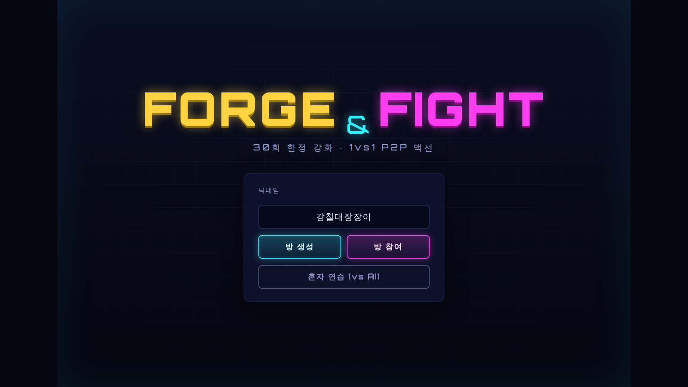
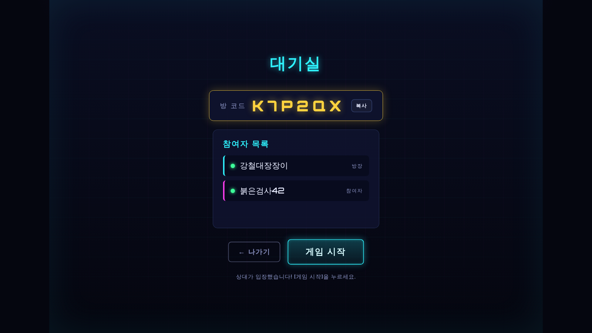
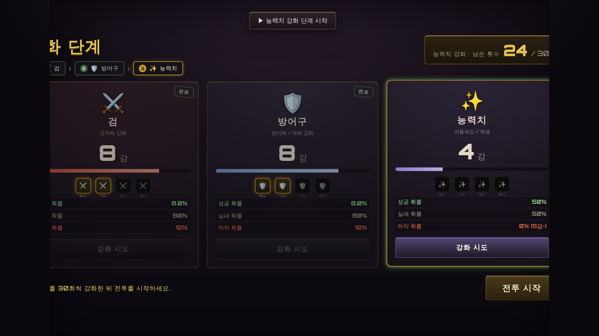
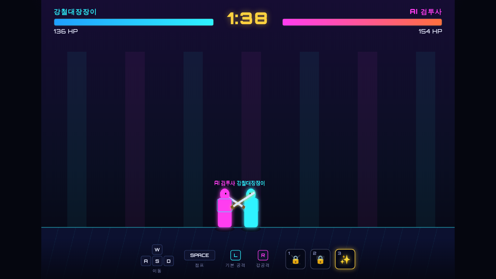

# ⚔️ FORGE & FIGHT — 강화 1vs1 P2P 액션

> **부위별 단계 강화(운/전략) + 직접 컨트롤 전투(피지컬)** 를 결합한 웹 기반 1vs1 2D 횡스크롤 액션 게임.
> 일러스트 풍의 **다크 판타지** 무드(달밤의 투기장 · 갑옷 기사)로 구현했습니다.

순수 **HTML / CSS / JavaScript** (빌드 도구 불필요)로 작성되었고, 실시간 P2P 대전은
[PeerJS](https://peerjs.com) (로컬 vendoring) 로 동작합니다. 외부 런타임 CDN 의존성이 없습니다.

---

## 🎮 바로 실행하기

브라우저 보안 정책(모듈/폰트/P2P) 때문에 `file://` 직접 열기 대신 **로컬 서버**로 실행하세요.

```bash
# 저장소 폴더에서
python3 -m http.server 8000
#   또는
npx serve .
```

→ 브라우저에서 `http://localhost:8000` 접속.

- **혼자 연습 (vs AI)** 버튼이면 네트워크 없이 즉시 플레이 가능합니다.
- **온라인 1vs1**: 한 쪽이 *방 생성*, 상대가 *방 참여*에서 6자리 코드 입력.
  - 서로 다른 PC에서 대전하려면 페이지가 **HTTPS**로 호스팅되어야 합니다 (예: GitHub Pages).
    PeerJS 기본 공개 시그널링 서버를 통해 P2P 데이터 채널을 연결합니다.

---

## 🕹️ 조작법

| 동작 | 키 |
|------|-----|
| 이동 | `A` / `D` |
| 점프 | `Space` |
| 빠른 낙하 | `S` (공중에서) |
| 기본 공격 | 마우스 **좌클릭** |
| 강공격 | 마우스 **우클릭** |
| 특수 스킬 | `1` 검 · `2` 방어구 · `3` 능력치 (해당 강화 5강부터 해금) |
| 일시정지 | `ESC` (계속하기 / 나가기 메뉴) |

**모바일(터치)**: 좌측 **가상 조이스틱**으로 이동(좌우)·**위로 밀면 점프**, **화면 탭 = 기본공격**,
우측 **강공 버튼** + **스킬 버튼(1·2·3)**. 세로 화면이면 가로 모드 전환 안내가 표시됩니다.

---

## 🔩 핵심 시스템 — 단계별 강화 (부위마다 30회)

**검 → 방어구 → 능력치** 순서의 단계 방식입니다. 각 부위는 **독립적으로 30회씩**(총합이 아님)
강화할 수 있고, 한 단계의 30회를 모두 쓰거나 우측 하단 **[다음 강화단계로 넘어가기]** 버튼을
누르면 다음 부위로 넘어갑니다. 마지막(능력치) 단계의 버튼은 **[전투 시작]** 이 됩니다.

- **검**=공격력 · **방어구**=최대 체력/피해 감소 · **능력치**=이동속도/체력 재생.
- **강화 한 강이 오를 때마다** 해당 능력치(검=기본/강공격력, 방어구=최대 체력/피해 감소,
  능력치=이동속도/체력 재생)가 **실제로 상승**하며, 강화 화면 각 패널에 **현재 수치와
  다음 강 수치(▲)** 가 표시됩니다.
- 각 부위 **0강 ~ 10강**, 강화 단계가 오를수록 성공 확률이 급감합니다.
- **5강부터 하락(다운) 확률** 적용 — 실패 시 단계가 떨어질 수 있습니다.
- **5 · 7 · 9 · 10강** 은 **스킬 강화 마일스톤**입니다 — **5강**: 스킬 해금(1·2·3) ·
  **7강**: 위력 +20% · **9강**: 쿨타임 -18% · **10강**: 극의(위력 +45%·쿨타임 -18%).
  강화 화면에서 네모 박스에 **마우스를 올리면(또는 탭하면)** 해당 단계의 스킬 효과 설명이 표시됩니다.

| 현재 단계 | 성공 | 하락 | (실패 유지) |
|:---:|:---:|:---:|:---:|
| 0→1 | 95% | – | 5% |
| 1→2 | 90% | – | 10% |
| 2→3 | 80% | – | 20% |
| 3→4 | 65% | – | 35% |
| 4→5 | 50% | – | 50% |
| 5→6 | 35% | 5% | 60% |
| 6→7 | 25% | 8% | 67% |
| 7→8 | 15% | 10% | 75% |
| 8→9 | 8% | 12% | 80% |
| 9→10 | **1%** | **15%** | 84% |

> 강화 결과가 그대로 전투 스탯으로 환산됩니다. 검=공격력, 방어구=최대 체력+피해 감소,
> 능력치=이동속도+체력 재생. 각 부위 5강이면 1·2·3 스킬의 자물쇠가 풀립니다.

---

## ⚔️ 전투 규칙

- 전투 진입 시 **3초 카운트다운**(3 · 2 · 1 · 시작!) 후 교전이 시작됩니다.
- **공중 장애물(원웨이 발판)**: 양옆 중간 발판 2개 + 높은 중앙 발판 1개. 아래에서 점프로
  통과해 올라설 수 있고, 발판 위에서 **`S`** 를 누르면 아래로 내려갑니다. 중앙 발판은
  옆 발판을 딛고 점프해야 닿아 입체적인 견제·추격이 가능합니다.
- 2D 옆 시점 횡스크롤, 양측 **100 HP**(+방어구 보너스), 제한시간 **1:40**.
- 시간 종료 시 **연장전** 진입 — 양측 **초당 3 데미지** 틱이 적용되어 무승부를 방지합니다.
- 특수 스킬
  - `1` **강철 베기** — 전방 돌진 광역 참격(대형 피해)
  - `2` **불굴의 방벽** — 약 2.2초 피해 무효화
  - `3` **질풍 가속** — 이동속도 폭증 + 체력 회복
- 하단 스킬 HUD는 **해금/쿨타임/사용 가능 여부를 색상 대비**로 표시합니다.

---

## 🖼️ 화면 구성 (5단계)

| | 화면 | 설명 |
|---|---|---|
| 1 | 로비 | 타이틀 로고, 닉네임(빈칸 시 랜덤), 방 생성/참여, 중복 닉네임 경고 팝업 |
| 2 | 대기실 | 참여자 목록 + 영문/숫자 방 코드, 코드 입력 필드, 게임 시작(전원 입장 시 활성), 로딩 연출 |
| 3 | 강화 단계 | 단계 표시줄(검→방어구→능력치), 부위별 30회 카운터, 확률/특수능력 아이콘, 다음 단계 버튼 |
| 4 | 인게임 전투 | 3초 카운트다운, 공중 발판 장애물, 중앙 타이머, 양측 체력바, WASD/마우스/1·2·3 조작 HUD |
| 5 | 결과 | 승/패 팝업, 다시 하기/나가기, 재대결·이탈 시스템 알림 |

<p align="center">
  
  <br/>
  
  <br/>
  
</p>

---

## 📁 구조

```
index.html              # 5개 화면 + 오버레이 마크업
css/styles.css          # 네온-레트로 테마, 16:9(1920×1080) 스테이지 스케일링
js/
  config.js             # 밸런스 수치(확률표, 스탯 환산, 쿨타임)
  state.js              # 공유 상태 + 빌드→스탯 환산
  ui.js                 # 화면 라우팅, 팝업/토스트/로딩, 스테이지 스케일
  net.js                # PeerJS 기반 P2P (방 코드 = 피어 ID)
  enhance.js            # 강화 단계 화면 로직
  battle.js             # 2D 전투 엔진(물리·AI·P2P 동기화·캔버스 렌더)
  main.js               # 전체 흐름·방 핸드셰이크·재대결/이탈 라이프사이클
vendor/                 # peerjs.min.js, Orbitron 폰트 (런타임 CDN 불필요)
docs/screenshots/       # 화면 캡처
```

## 🌐 P2P 동작 방식

호스트가 `방 생성` 시 `ff-glx-<코드>` 피어 ID로 등록되고, 게스트는 그 ID로 접속합니다.
월드 좌표는 양측이 공유(호스트=좌측 P1, 게스트=우측 P2)하며, 각 플레이어는 자기 캐릭터만
조작하고 **타격/사망 이벤트**를 상대에게 통보합니다. **전투 타이머는 호스트가 기준(authority)**
이 되어 매 동기화 패킷에 남은 시간·연장전 상태를 실어 보내고 게스트가 이를 채택하므로,
양측의 게임 시간이 항상 일치합니다. 시그널링 실패 시 자동으로 *연습 모드* 안내로 폴백됩니다.

---

## 📜 라이선스

MIT — [LICENSE](LICENSE) 참고. PeerJS / Orbitron 폰트는 각 원저작자의 라이선스를 따릅니다.

---

## 📌 버전

**v1.9.1** (2026-06-16) — **효과음 볼륨 상향** — 소리가 작다는 피드백을 반영해 마스터 볼륨을 0.5 → 0.9로 올렸습니다(컴프레서가 피크를 잡아 클리핑 방지).

- **v1.9.0** (2026-06-16) — **효과음(SFX) 전면 추가** — Web Audio API로 모든 소리를 실시간 합성(에셋/CDN 의존성 없음). 로비/메뉴 **버튼 클릭음**, 강화의 **성공·실패·하락·10강 달성** 음, 인게임 **카운트다운(쿠웅하는 웅장한 부밍)** 과 **시작 팡파레(빰 빰빠밤)**, **걷기·점프·착지·공중 발판 밟기**, **기본/강공격·타격음**, **검·방어구·능력치 스킬음**, 사망 시 **바닥에 떨어지는 둔탁한 충격음**, **승리/패배 음악**까지. 첫 사용자 입력 시 오디오가 활성화되며, Web Audio 미지원 환경에서는 자동으로 무음 처리됩니다.

- **v1.8.2** (2026-06-16) — **이동 속도 소폭 하향** — 캐릭터 이동이 다소 빠르다는 피드백을 반영해 이동 속도를 약 15% 낮췄습니다(`SPEED_BASE` 6.4→5.4, `SPEED_PER_STAT_LV` 0.42→0.36). 능력치 강화에 따른 속도 증가 폭은 그대로 유지됩니다.

- **v1.8.1** (2026-06-16) — **공중에서 죽을 때 낙하 모션 수정** — 공중에서 쓰러질 때 제자리(공중)에서 임팩트가 나던 문제 해결. 이제 **중력에 따라 땅바닥까지 떨어진 뒤** 착지 임팩트(흙먼지)가 나옵니다. 떨어지는 동안에는 **팔·다리가 위로 향하고 허리(골반)가 아래로 처지는** 축 늘어진 낙하 포즈를 취하며, 바닥에 닿으면 눕는 자세로 마무리됩니다.

- **v1.8.0** (2026-06-16) — **이전 강화 단계로 돌아가기** — 횟수가 남은 채로 실수로 다음 단계로 넘어가도 되도록, 각 단계의 **남은 강화 횟수를 단계별로 보존**하고 좌측 하단에 **`← 전 강화 단계로`** 버튼을 추가했습니다. 이전 단계에 횟수가 남아 있을 때만 버튼이 나타나며, 돌아가면 남은 횟수가 그대로 유지됩니다(다시 30회로 초기화되지 않음).

- **v1.7.0** (2026-06-16) — **패배 연출 추가** — 승부가 나면 화면이 즉시 멈추지 않고, 진 플레이어가 **뒤로 쓰러지는 모션**(무릎 꺾임 → 뒤로 넘어짐 → 착지 반동 → 흙먼지 → 서서히 페이드)을 디테일하게 재생합니다(검을 떨어뜨리고 다리가 벌어지며 고개가 젖혀짐). 모션이 끝나고 **약 1초 뒤** 승리/패배 화면이 **아래에서 위로 떠오릅니다**. 쓰러지는 동안 승자는 그대로 서 있고, 컷신 중 입력/일시정지는 차단됩니다.

- **v1.6.2** (2026-06-16) — **한글 입력 모드(IME)에서 인게임 조작 불가 수정** — 키보드가 한글 상태일 때 `e.key`가 `ㅁ`/`ㄴ` 같은 한글 문자를 반환해 `A`/`D`/`S`·점프·스킬이 동작하지 않던 문제 해결. 이제 물리 키 위치(`e.code`)를 기준으로 입력을 인식하므로 한글이든 영어든 동일하게 움직입니다.

- **v1.6.1** (2026-06-15) — 온라인(P2P) **전투 타이머 동기화 수정** — 양 플레이어가 각자 로컬로 시간을 세어 어긋나던 문제 해결. 호스트가 시계 기준(authority)이 되어 `timeLeft`·연장전 상태를 동기화 패킷에 실어 보내고, 게스트는 이를 채택해 양측 타이머가 일치합니다.

- **v1.6.0** (2026-06-15) — 인게임 **ESC 일시정지 메뉴**(계속하기 / 나가기 — 나가기 시 로비로, 온라인은 상대에게 종료 통보) · 조작 개편: **점프는 `Space`만**(W 제거), 이동은 `A`/`D` · 전투 HUD 표시 갱신(A/D · SPACE · S 빠른 낙하)

- **v1.5.0** (2026-06-15) — 강화 화면에 **부위별 실제 능력치 표시**(검=기본/강공격력, 방어구=최대 체력/피해 감소, 능력치=이동속도/체력 재생, 현재→다음 강 ▲로 표시) · **마일스톤 스킬 강화 체계**(5강 해금 · 7강 위력 +20% · 9강 쿨타임 -18% · 10강 극의 위력 +45%) — 전투에서 실제 적용 · 5·7·9·10강 네모 박스 **마우스 오버/탭 시 스킬 설명 툴팁**

<details>
<summary>이전 버전</summary>

- **v1.4.1** (2026-06-15) — 모바일 UI 수정: 스테이지가 좁은 화면에서 flexbox에 의해 줄어들어 메뉴가 잘리던 문제 해결(`flex:0 0 auto`) · 에셋 캐시 버스팅(이전 CSS 캐시로 컨트롤이 메뉴에 노출되던 문제 해결) · 전투 화면에서만 컨트롤 표시(이중 차단) · 우측 컨트롤 한 줄 클러스터([1][2][3] 강공)로 재배치

- **v1.4.0** (2026-06-15) — 모바일 터치 컨트롤 추가(가상 조이스틱 이동·위로 점프 · 화면 탭 기본공격 · 강공/스킬 버튼 · 세로 모드 안내)

- **v1.3.0** (2026-06-15) — P2P 반응성 개선(즉각 이동·속도 예측 보정·동기화 45Hz·사망신호 이중화) · 공중 발판 높이 상향 · 발판 가장자리 점프 판정 완화(코요테 타임 + 착지 여유)
- **v1.2.1** (2026-06-15) — GitHub Pages 자동 배포 워크플로우 추가
- **v1.2.0** (2026-06-15) — 인게임 공중 발판(원웨이 플랫폼) 장애물 추가 · `S` 내려가기 · AI 발판 추격
- **v1.1.0** (2026-06-15) — 강화 단계화(부위별 30회) · 전투 3초 카운트다운 · 다크 판타지 아트 리디자인
- **v1.0.0** (2026-06-14) — 최초 구현: 로비 / 대기실 / 강화 / 전투 / 결과 5개 화면, P2P(PeerJS) + AI 연습 모드

</details>
